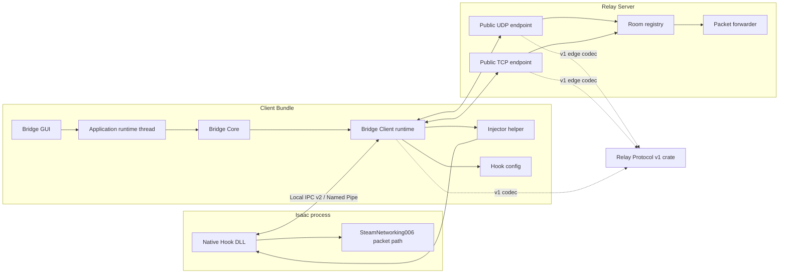

# Architecture

Tractor Beam is split into a Rust core library, an egui desktop GUI, a Rust
relay server, a Rust injector helper, and a small Rust native hook.

## Modes

- `Official`: no hook or Relay Transport; the Bridge Client still owns Isaac
  process supervision so application lifecycle behavior stays consistent.
- `Fallback`: bridge packet transport with Steam receive fallback enabled.
- `Pure`: bridge packet transport with Steam receive fallback disabled.

`Pure` is the target bridge mode.

## Native Hook Boundary

The Native Hook is intentionally narrow:

- x86 only, matching `isaac-ng.exe`.
- patches the Steam P2P interface used by the Steam friend-lobby path.
- forwards opaque packet payloads.
- reads Bridge-managed hook launch parameters from the Native Hook directory;
  Isaac `online_logs` remains a hook log source, not a user configuration home.

Hook callbacks never perform cross-process I/O, framing, retry, or log
formatting. They copy an accepted opaque payload into a bounded queue with one
non-blocking `try_send`. A dedicated Hook worker owns the connection and all
serialization.

## Local IPC Boundary

The Hook and Bridge Client use one full-duplex `interprocess` Local Socket,
which maps to a Named Pipe on Windows. `hook-ipc` defines local protocol v2
(`TBI2`) with directional typed messages serialized by Postcard and framed by
Postcard COBS. A per-session random identity is present in the endpoint and in
the role/version handshake; it is never included in normal logs or exported
diagnostics.

Client and Hook data queues are bounded and drop the newest packet on
overflow, while Input Delay, handshake, liveness, health, and shutdown use a
separate priority path. A connected pipe may re-handshake only for a short
window within the same application/session/exact Isaac process. Version or
session mismatch is terminal; there is no UDP/TCP compatibility fallback.

Windows Named Pipes are driven in non-blocking mode with explicit read/write
deadlines and liveness ping/pong because the transport does not support socket
timeout APIs. IPC connection state, negotiated version, reconnects, malformed
frames, and drop counters flow into diagnostics.

This local protocol is independent of Relay Protocol v1. The current Relay
envelope/game bytes remain unchanged; future Relay v2 work must use a separate
version boundary.

## Relay Protocol v1 Boundary

`relay-protocol` is the byte-stable public wire boundary shared by Client and
Relay. It owns the `BBR1` Envelope, control JSON, `BBG1` GamePacket, v1
constants, codecs, and golden fixtures. It owns no sockets, rooms, config,
metrics, build information, or local Hook IPC.

Inside the Relay, `v1` is the only admission/room adapter between wire types
and internal domain commands and outcomes. Room state receives explicit
domain values and never imports `Envelope`, `ControlMessage`, or other v1 wire
types. Transport egress and aggregate metrics are downward helpers rather than
peer orchestrators.

Relay v1 deliberately keeps exact major/minor admission matching and carries
capability bits without negotiating behavior. Its fixed Envelope plus
GamePacket overhead is 82 bytes: a common 1472-byte IPv4 UDP application
datagram budget therefore leaves 1390 bytes for the game payload. Relay stats
aggregate fixed payload/wire size buckets, interval maxima, and counts above
those limits; they never log game payloads or per-player size labels.

The Rust Bridge Client owns configuration, process launch, exact Isaac process
binding, Relay Transport selection, status, and diagnostics. The Bridge GUI
owns presentation and bounded form state. A dedicated in-process application
runtime thread owns `BridgeClient`, executes slow commands, and publishes an
authoritative snapshot back to egui; egui callbacks never wait for session,
filesystem, Steam, network, probe, or shutdown work.

Session supervision owns essential data-plane tasks separately from support
tasks such as exact Isaac process monitoring. Official, Fallback, and Pure all
bind one process identity (PID, image name, and start time) per explicit Start.
When that exact process exits, the first terminal reason wins, all owned tasks
are cancelled and awaited, and the application returns to Idle without
reviving if Isaac is launched again.

## Rust Crate Boundaries

- `bridge-core`: Bridge Client runtime, diagnostics, Steam account/path
  detection, and hook launch parameter helpers. It consumes the two shared
  protocol crates but owns neither wire contract. It owns no GUI presentation
  and no relay process.
- `bridge-gui`: egui desktop presentation for the player-facing app. It
  depends on `bridge-core`, owns the background application composition root,
  and does not own transport behavior.
- `bridge-relay`: deployable UDP/TCP Relay Server binary and room registry. It
  maps `relay-protocol` wire messages at the server edge and keeps domain state,
  transport egress, and bounded metrics independent of those wire types.
- `isaac-injector`: process discovery plus the injector helper binary used to
  load the Native Hook into Isaac.
- `native-hook`: Windows i686 DLL for the SteamNetworking006 packet path.
- `hook-ipc`: shared Native Hook/Bridge Client local IPC protocol primitives;
  neither endpoint owns the other's runtime.
- `relay-protocol`: shared, byte-stable Relay v1 wire types, codecs, constants,
  and golden fixtures; it has no Client or Relay runtime dependencies.

The Injector remains a separate crate so the Client Bundle can ship an i686
helper alongside the i686 Native Hook while the Bridge GUI can stay a normal
desktop binary.

See `relay.md` for Relay Server settings and deployment.
