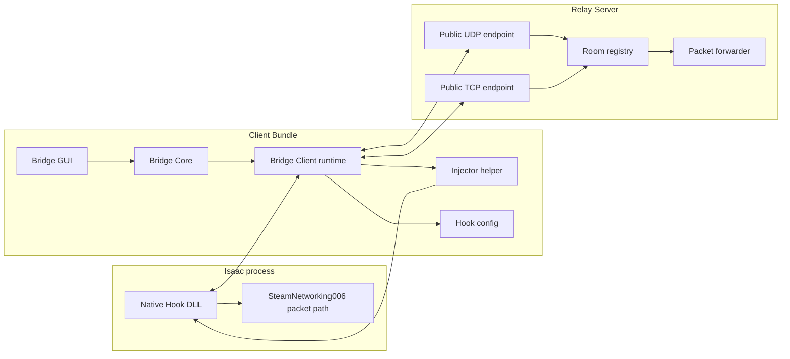

# Architecture

Basement Bridge is split into a Rust core library, an egui desktop GUI, a Rust
relay server, a Rust injector helper, and a small Rust native hook.

## Modes

- `Official`: no Bridge Client, no hook, normal Steam online.
- `Fallback`: bridge packet transport with Steam receive fallback enabled.
- `Pure`: bridge packet transport with Steam receive fallback disabled.

`Pure` is the target bridge mode.

## Native Hook Boundary

The Native Hook is intentionally narrow:

- x86 only, matching `isaac-ng.exe`.
- patches the Steam P2P interface used by the Steam friend-lobby path.
- forwards opaque packet payloads.
- reads bridge settings from the Isaac online log directory.

The Rust Bridge Client owns configuration, process launch, Relay Transport
selection, status, and diagnostics. The Bridge GUI owns presentation and user
input.

## Rust Crate Boundaries

- `bridge-core`: Bridge Client runtime, relay/local protocol, diagnostics,
  Steam account/path detection, and hook configuration helpers. It owns no GUI
  presentation and no relay process.
- `bridge-gui`: egui desktop presentation for the player-facing app. It
  depends on `bridge-core` and does not own transport behavior.
- `bridge-relay`: deployable UDP/TCP Relay Server binary and room registry. It
  uses `bridge-core::protocol` for wire formats and keeps transport-specific
  egress details outside room routing.
- `isaac-injector`: process discovery plus the injector helper binary used to
  load the Native Hook into Isaac.
- `native-hook`: Windows i686 DLL for the SteamNetworking006 packet path.

The Injector remains a separate crate so the Client Bundle can ship an i686
helper alongside the i686 Native Hook while the Bridge GUI can stay a normal
desktop binary.

See `relay.md` for Relay Server settings and deployment.
