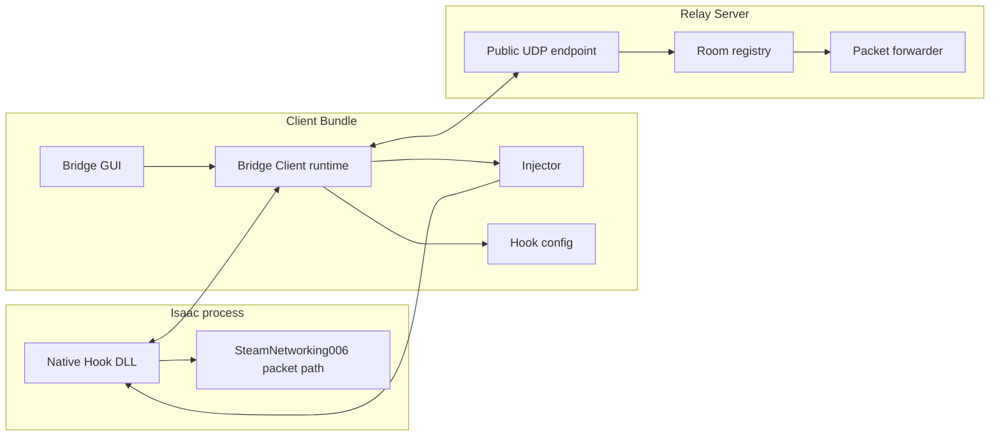

# Architecture

Basement Bridge is split into a small native hook, a Rust client runtime, an
egui desktop GUI, and a Rust relay server.

## Modes

- `Official`: no Bridge Client, no hook, normal Steam online.
- `Fallback`: bridge packet transport with Steam receive fallback enabled.
- `Pure`: bridge packet transport with Steam receive fallback disabled.

`Pure` is the target bridge mode.

## Native Hook Boundary

The Native Hook is intentionally narrow:

- x86 only, matching `isaac-ng.exe`.
- patches the Steam P2P interface used by the Steam friend-lobby path.
- forwards opaque packet payloads.
- reads bridge settings from the Isaac online log directory.

The Rust Bridge Client owns configuration, process launch, relay selection,
status, and diagnostics. The Bridge GUI owns presentation and user input.

## Rust Crate Boundaries

- `bridge-protocol`: no IO; packet structs, encoding, decoding, and versioning.
- `bridge-relay`: UDP relay runtime and room registry.
- `bridge-client`: local client runtime without UI ownership.
- `bridge-gui`: egui desktop presentation for the player-facing app.
- `bridge-diagnostics`: log discovery, summarization, and diagnostic bundles.
- `steam-detector`: Steam install, account, and SteamID64 discovery.
- `isaac-injector`: process discovery and hook injection orchestration.

See `configuration.md` for where relay and hook settings live today.
